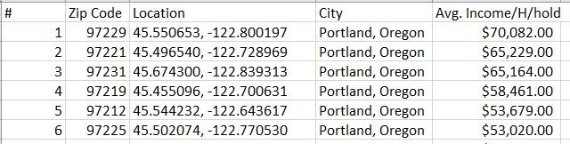
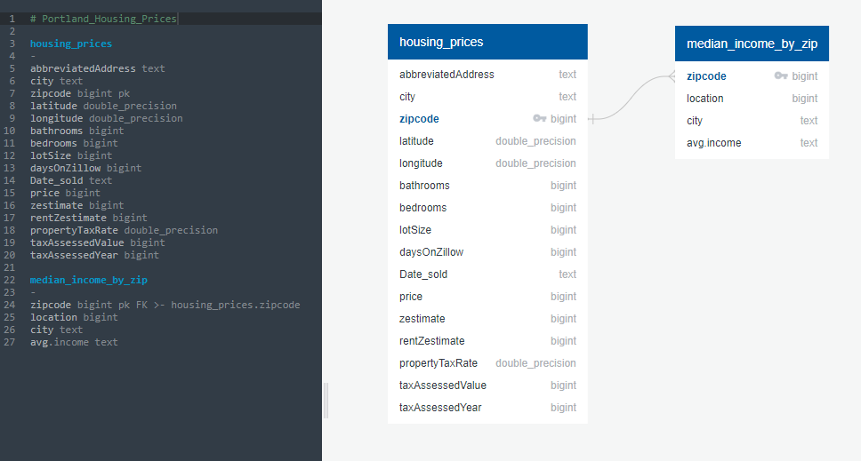

# Portland_Housing_Prices
An analysis of housing prices in Portland, Oregon using Python's pandas library, SQL, Tableau, and linear regression machine learning.

### The Team (and their roles)
- [Robin Foster](https://github.com/rloufoster)
    >**Roles:** Data recruiter, cleaner; Exploratory data analyst; Linear regression machine learning co-architect; Scikitlearn library specialist; co-presenter.

- [Laura Hemydin](https://github.com/L-Hmd)
    >**Roles:** Data recruiter, cleaner; Exploratory data analyst; Primary SQL author and PostgreSQL specialist; Database architect; co-presenter.

- [Kayla Howell](https://github.com/kbowling74)
    >**Roles:** Data recruiter, cleaner; Exploratory data analyst; Documentation author; Linear regression machine learning co-architect; Scikitlearn library specialist; visualization collaborator; co-presenter.

- [Sam Steffen](https://github.com/SamSteffen)
    >**Roles:** Data recruiter, cleaner; Exploratory data analyst; Python enthusiast; GitHub repository manager; co-presenter.

- [Marty Thompson](https://github.com/martyet1)
    >**Roles:** Data recruiter, cleaner; Exploratory data analyst; Tableau specialist; Primary dashboard architect; co-presenter.

# Overview
## What We're Trying To Solve
Zillow's 'zestimator' is a well-known and widely-used machine learning algorithm that predicts house price for site-users based on a variety of features. This project is an attempt to create a home price estimator similar to the one used by Zillow, to predict housing prices based on regional median income by zipcode. Below we have documented the creation of a linear regression machine learning model that draws on known sale prices of homes in Portland, Oregon to predict future sale prices based on number of bedrooms, number of bathrooms, lot size, zip code and median income for each zip code.

## Tools
To analyze and prepare our data for our machine learning model, we plan to use the following tools:
- **Excel** - Most of our data will be downloaded from an online source in csv format, from which it will be imported to a jupyter notebook for initial cleaning
- **Python** - Using Python's pandas library, we will create dataframes from our dataset and prepare it for importing to our SQL database.
- **PostgreSQL** - We will use SQL to merge multiple datasets into a single database.
- **Tableau** - We will use Tableau Public to create visualizations of cleaned, merged data, taken from our PostgreSQL database. 
- **GitHub** - GitHub will host our repository.

## Strategy and Metrics
The goals of this analysis include:
- Utilize recent housing data to reflect current market trends.
- Develop a linear regression machine learning model capable of predicting housing sale price (target variable) using number of bedrooms, number of bathrooms, lot size and median household income by zipcode, with an accuracy score of 90% or higher.

## Data Artifacts
Data products this project will produce include:
- Visualizations of housing price, average interest rate, average income over a given time period, within a specified location, available on a shareable storyboard (Tableau Public).
- Confusion Matrix
- Accuracy score summary reports
- Evidence of our discovered insights will be available in the summary section of this README.

## Data Sources
The data for this project was sourced from the following locations:
- [Portland house price data (Kaggle.com)](https://www.kaggle.com/datasets/threnjen/portland-housing-prices-sales-jul-2020-jul-2021?select=portland_housing.csv)
- [Income data (zipatlas.com)](http://zipatlas.com/us/or/portland/zip-code-comparison/median-household-income.htm) 
- [Portland Census data (census.gov)](https://www.census.gov/quickfacts/fact/table/portlandcityoregon/INC110220#INC110220)
- [Portland Zip Code data (google.com/maps)](https://www.google.com/maps/@45.5427139,-122.6544011,11z)

# Procedure
## Preprocessing and Initial Findings:
>Dataset 1: Portland Housing Data
- Our first dataset was downloaded from Kaggle.com, containing information pertaining to the housing market, regional to Portland, Oregon. The initial dimensions included 348 columns and more than 25,000 unique rows of data.

After pairing the columns down from 348 to 13, we were yielded 21,168 rows of usable data that provided housing prices and Zillow estimates for homes in Portland and the surrounding area, between the dates of June 12, 2020 to July 15, 2021.

The final features of this cleaned dataset include:    
    - Address (abbreviated)       
    - City    
    - Zipcode    
    - Latitude coordinates    
    - Longitude coordinates    
    - Days on Zillow    
    - Date Sold    
    - Price (what the house actually sold for, US dollar amount)    
    - Zestimate (what Zillow predicted the house would sell for, US dollar amount)    
    - Rent Zestimate (what Zillow predicted the house could be rented for, US dollar amount)    
    - Property tax rate    
    - Tax assessed value (what the value is deemed worth according to the taxing authorities)    
    - Tax assessed year    

Further exploration of this dataset showed that there were 62 unique zip codes present, with value counts ranging from 1 to 1001 per zipcode. To make sure our data was more evenly distributed from the outset, we filtered this data to return only data for zip codes that included more than 500 rows of data. This left us with 17 unique zip codes, and 11,854 rows of data.

>Dataset 2: Combined Income, Census, and Zipcode Data
- Our second dataset was compiled from zipatlas.com, census.gov and google.com/maps websites. These sources were combined to generate a dataset of median household income for zipcodes that were available in our first dataset.

## Transforming and Loading the Data into the Database (PostgreSQL)
Once the raw data was cleaned, it was exported as a csv and loaded into PostgreSQL where it was joined together using the Portland zipcodes in the first dataset as the primary key to retrieve and append the median household income from the second. The image below depicts the entity relationship diagram (ERD) of the data:

The datasets were merged using a left join to generate a new table that contained the target variable (housing prices) and the independent variables (number of bedrooms, number of bathrooms, lot size, and median household income). The image below depicts the results of this SQL join query:

## Linear Regression (Supervised) Machine Learning Model
Because our target variable (housing prices) is a known and labeled entity in our dataset, it was determined to create a supervised machine learning model using python's scikitlearn libraries, to predict housing prices in several Portland zipcodes based on number of bedrooms, number of bathrooms, lot size, and median household income. 

# Visualizing the Data
A dashboard for this dataset is available on [Tableau Public.](https://public.tableau.com/app/profile/marty.thompson/viz/HousingPricesinPortlandOR/PricevsDaysonZillow)